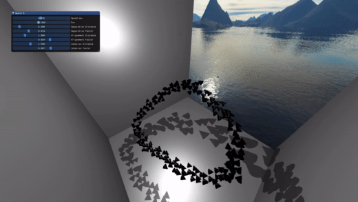

# OpenGL Engine Project

The purpose of this project is to learn about OpenGL features and Real-Time Rendering techniques.
The final objectives is to implement a little Game Engine;

It is implemented using OpenGL 4.5 and C++.

## Features

### Implemented
- Skybox
- Shadow Mapping with directional and point lights.
- Water Rendering
    - Tessellation of water surface
    - Changes following sin for waves simulating
- Deferred Shading
- Boids Simulation

## Build
```sh
# Build
./build.sh
```
```sh
# Run
./engine [your-scene.json]
```

## Libraries
- [GLFW](https://www.glfw.org/) --> OpenGL context and window API
- [GLAD](https://github.com/Dav1dde/glad) --> OpenGL loader
- [Assimp](https://www.assimp.org/) --> 3D objects loader
- [GLM](https://glm.g-truc.net/0.9.2/api/index.html) --> Vectors, matrices ... operations header
- [STB](https://github.com/nothings/stb) --> Image loader

In order to use this project you must install GLFW and Assimp on your computer.

:exclamation::exclamation: All textures should be at **jpeg** format.

## Results

[](https://www.youtube.com/watch?v=JS43Ozl9Hzw)
